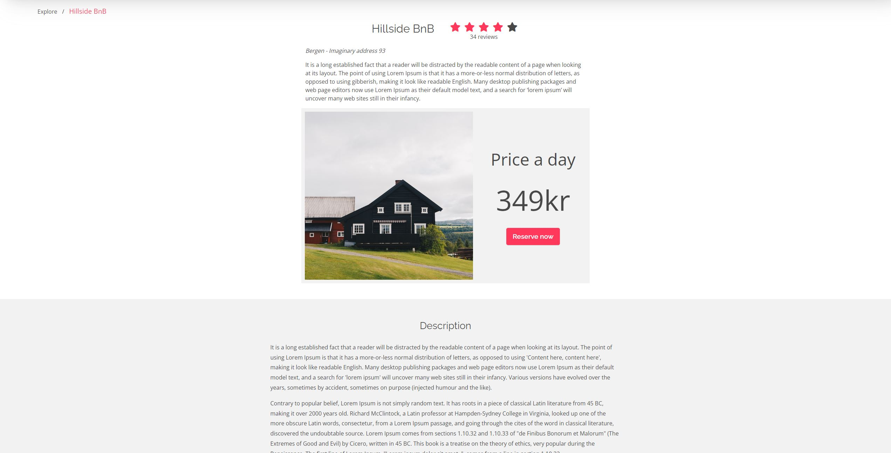

### Login details

username: eivindsimonsenjsframeworks.one

password: Admin1234

### Image urls for product creation

https://media-cdn.tripadvisor.com/media/photo-s/1b/fb/12/0c/citybox-bergen.jpg

https://www.eivindsimonsenjsframeworks.one/wp-content/uploads/2022/08/nick-night-LDvZK-3ZFRQ-unsplash.jpg

# Project exam 2 - My final exam

> This was my final exam as a frontend developer student at Noroff. I was tasked in creating a accommodation booking website based in Bergen.
> Live demo [_here_](https://holidazeeivindsimonsen.netlify.app/). <!-- If you have the project hosted somewhere, include the link here. -->

## Table of Contents

- [General Info](#general-information)
- [Technologies Used](#technologies-used)
- [Features](#features)
- [Screenshots](#screenshots)
- [Setup](#setup)
- [Login](#login)
- [Project Status](#project-status)
- [Room for Improvement](#room-for-improvement)
- [Contact](#contact)
<!-- * [License](#license) -->

## General Information

The tasks i was required to complete was creating an API to store all my accommodation, as well as comments from users and booking enquiries. I used wordpress REST api for this, with woocommerce for accommodations.

The user is ment to be able to look up different accommodations, either through looking through a list, or searching in the search bar. Every accommodation has it's own detailed page.

There is also login possible for admin users, where you could see user comments, and create new accommodations. Also provided a list of all sent enquiries.

## Technologies Used

    - "@hookform/resolvers": "^2.9.7",
    - "@testing-library/jest-dom": "^5.16.5",
    - "@testing-library/react": "^13.3.0",
    - "@testing-library/user-event": "^13.5.0",
    - "axios": "^0.27.2",
    - "date-fns": "^2.29.2",
    - "react": "^18.2.0",
    - "react-bootstrap": "^2.5.0",
    - "react-bootstrap-typeahead": "^6.0.0-rc.3",
    - "react-dom": "^18.2.0",
    - "react-hook-form": "^7.34.2",
    - "react-router-dom": "^6.3.0",
    - "react-router-hash-link": "^2.4.3",
    - "react-scripts": "5.0.1",
    - "sass": "^1.54.5",
    - "web-vitals": "^2.1.4",
    - "yup": "^0.32.11"

## Features

List the ready features here:

- Search bar typeahead
- Get request
- Login
- Contact messaging
- Booking

## Screenshots

<!-- If you have screenshots you'd like to share, include them here. -->

## Setup

To install and start the project:
`npm install npm start`

## Login

`username: eivindsimonsenjsframeworks.one password: Admin1234`

## Project Status

Project is: / _complete_ /

## Room for Improvement

Include areas you believe need improvement / could be improved. Also add TODOs for future development.

Room for improvement:

- All accommodations have the same star rating, because i couldn't make this work in REST API, so i scrapped that part, at least for now.

- Validation on some of the forms are broken because YUP and posting data to endpoints don't work well together.

- Searchbar typeahead loads matching results slowly.

To do:

- Working star rating system
- Full validation
- Searchbar typeahead load time decrease

## Contact

Created by [@eivindsimonsen](https://www.linkedin.com/in/eivind-simonsen-9469121b9/) - feel free to contact me!
